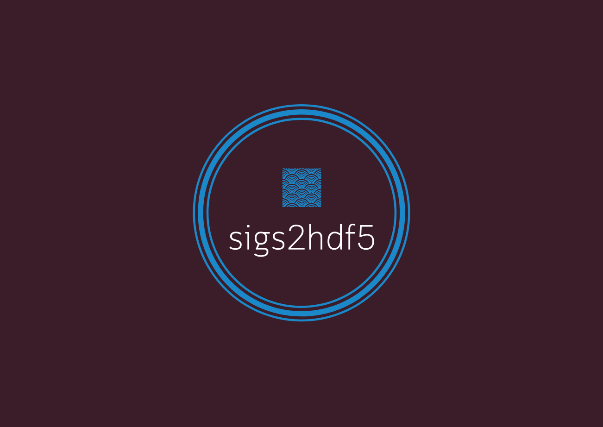

# combine result singals

A set of scripts and samples to combine seismo files into single binary file in HDF5 format.  

## Description of included files:  
* combine_signal_files_into_a_single_one.f90: fortran code which do the combine process.  
* test_script_convert_signals_to_one_single_binalize.py: python script for usage of the combine code.  
* test_script_open_binarized_file.py: sample python script for opening the combined binary file.  
* compile_on_occigen.sh: useful script when one comile the fortran code on OCCIGEN/CINES. 
* test_signals: folder where the sample signals are put.  
  

## To use in your environment
1. compile combine_signal_files_into_a_single_one.f90 with compile flags for HDF5  
`h5pfc (or h5fc) combine_signal_files_into_a_single_one.f90 -o combine`  
(just do `./compile_on_occigen.sh` if you use it on OCCIGEN)  
2. `python test_script_convert_signals_to_single_binary.py -d directory/path/*.semp -o outname.h5` then the result will be saved as outname.h5  
   
